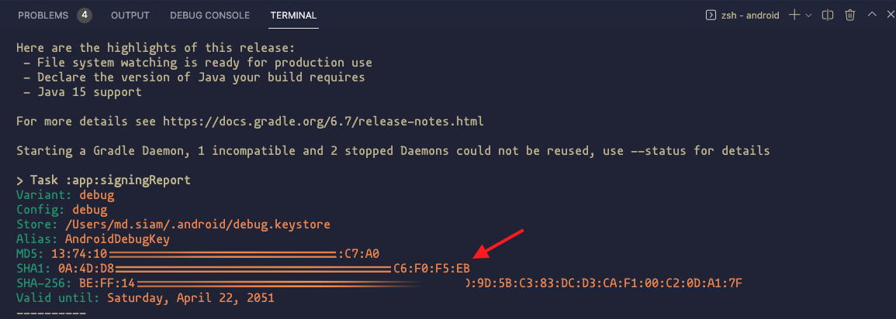

# Nilam (নিলাম)

This is an auction application just like eBay. Using firebase as the backend for storing data.</br>
Features:
1. User can signing using their gmail account.
2. After login, the user will see the auction item gallery, which shows the items everybody else has put up for auction.
3. Users can place bids on items posted by others within the Auction End DateTime. If they click on any item in the auction item gallery, they will be taken to the auction page of that item, where they can see the  Product Name, Product Description, Product Photo, Minimum Bid Price, and Auction End DateTime. It will also show a table of bids placed by other users for that product. An user can input their bid in the auction item page for that product. After inputting a bid, it shows up in the bid list. The user can edit their bid before the auction ends.
4. The auction will end at Auction End DateTime, If you enter the auction item page for any item, it will show the bid winner for that item.
5. In addition to that, there is a dashboard which will show the total number running bids, total number of completed bids, total value of completed bids(multiply winning bid price with quantity of products). Show a time series of these data as well in a line chart. The statistics are for all auctions combined, all the user should be able to see these stats.

## Task Completed & Challenges:

1. Sign in using a Google account. The complete procedure is given below.

## 1. Sign-in using a Google account

Watch this video to learn about google sign in: [Google SignIn with Flutter](https://www.youtube.com/watch?v=Q00Foa8CiDk&t=833s)

## 5. Dashboard

Charts are drawn using "syncfusion_flutter_charts" dart package. [Documentation](https://help.syncfusion.com/flutter/cartesian-charts/getting-started)

### Apple firebase setup:

Follow the video carefully for ios setup.

### Android firebase setup:

For SSH1 fingerprint: from your terminal, go to the "android" folder

```
$ cd android
$ ./gradlew signingReport
```

Before doing that, make sure that Java Environment is already set up on your computer. 

Copy & paste this SHA1 key to the firebase insert box befire generating the "google-services.json" file.

## Packages used in "pubspec.yaml":
```
  # For accessing FontAwesome icons
  font_awesome_flutter: ^9.2.0
  # For swiping effects
  flutter_swiper_null_safety: ^1.0.2
  # For signing in with Gmail account
  google_sign_in: ^5.2.1
  # For Statementing
  get: ^4.3.8
```